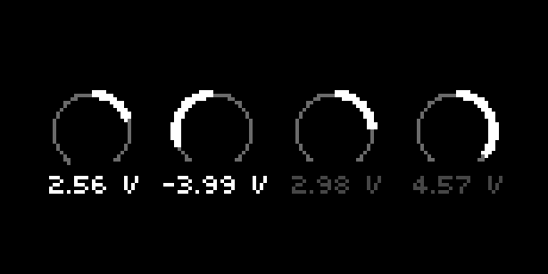

# 4 Big Knobs
Send control voltages out of Crow. Intended for use with Arc, where each Arc encoder controls the voltage sent from the corresponding Crow output.

## UI

* 4 dials showing current voltage values
* Ships with helper text to help you learn the ropes (disable helper text in params menu)

## Controls
### Arc (optional)
* Each encoder is mapped to the corresponding dial on screen

### Norns
* E1 changes which dials are focused
* E2 & E3 are mapped to the highlighted dials on screen

### Snapshot mode
* Switch modes via Params menu. Defaults to Snapshot mode if launched with an Arc connected
* K2 & K3 save current state to one of two snapshot banks
* E1 interpolates between the two snapshots

### Quantize mode
* Switch modes via Params menu
* E2 & E3 select scale root and scale type
* K2: Toggle between continuous quantization and on-demand quantization
* K3: Quantize now!
* Set slew timing for quantization in the Params > Quantization menu

## Additional Parameters
* Crow Outputs
  * Slew time
  * Minimum and Maximum voltage
  * Customize dial -> Crow output mapping
  * Direct control over dial values (can be used for MIDI mapping if you'd like a different control surface)
* Crow Inputs
  * Each Crow input can exert influence over all the Crow outputs via Attenuation or Offset
  * Defaults to Offset
* Misc
  * If you have a Norns shield, you can switch top left and right text to match where your E1 is
  * You can turn off the helper text once you understand how it works

## Requirements
* norns (200712 or later)
* crow (2.0.0 or later)
* arc optional, but encouraged
  * use a MIDI device in place of an arc by going into the params menu, clicking “map”, scrolling to “crow outputs”, scroll to “1_volt” and the other 4 options, and map each of them to a different control on the MIDI device

## Roadmap
## Quantization mode
* More scales (whole volts, 10TET, more?)

## Snapshot interpolation improvements
* If use arc to move while halfway thru interpolating, still slew over the course of the knob to the target when resuming interpolation
  * In effect, take a snapshot whenever arc is touched, include current interpolation position in that snapshot
